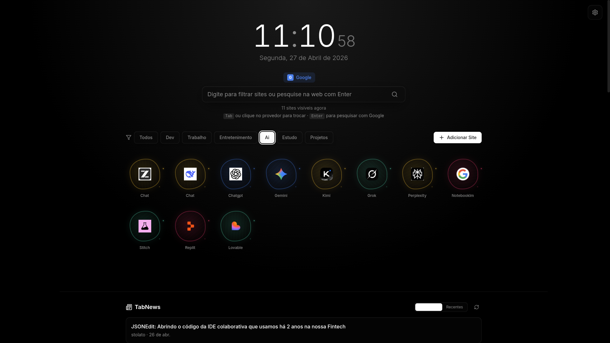

# 🪐 Orbit

**Sua página inicial, do seu jeito.**

Orbit é uma startpage personalizada para seu navegador. Rápida, bonita, sem contas, sem backend. Apenas você e seus sites favoritos — a um clique de distância.

---

## 👀 Preview

---

## 🤔 Por que usar?

Você abre o navegador dezenas de vezes por dia. Cada vez é a mesma história: digitar o mesmo site, fazer a mesma pesquisa, perder tempo.

**Orbit resolve isso.** Tudo que você precisa, uma tela de distância.

---

## 📖 Sobre

Orbit nasceu da frustração com páginas iniciais genéricas e invasivas. É um projeto open source feito por quem usa — sem contas, sem backend. Seus atalhos, temas e preferências ficam no `localStorage` do navegador. Sua startpage, seus dados, seu jeito.

---

## ✨ Funcionalidades

### 🕐 Relógio e Data
Exibição em tempo real, sempre visível. Simples e elegante.

### 🔍 Barra de Pesquisa Inteligente
- `Tab` → alterna entre provedores (Google, DuckDuckGo, YouTube, Ecosia) e Chat IA
- Digite para filtrar seus sites simultaneamente
- `Enter` → abre a busca web

### ⭐ Sites Frequentes
- O Orbit conta quantas vezes você abre cada site e monta uma aba **Frequentes** sozinho
- Os contadores ficam só no seu navegador — dá para zerar quando quiser

### 🗂️ Espaços de Trabalho
- Crie conjuntos independentes de sites: **Pessoal**, **Trabalho**, **Estudos**...
- Troque de contexto com um clique, sem misturar os atalhos
- Remover um espaço nunca apaga sites — eles são movidos para outro

### 🌤️ Clima
- Temperatura, condição, máxima/mínima e sensação térmica logo abaixo do relógio
- Dados do **Open-Meteo** — gratuito e **sem API key**
- Busque a cidade pelo nome ou use sua localização

### 📝 Notas Rápidas e ⏱️ Pomodoro
- Bloco de anotações sempre à mão, salvo automaticamente
- Timer de foco com ciclos de 25/5 min, com o tempo no título da aba
- O timer usa o relógio do sistema, então não atrasa com a aba em segundo plano

### 📴 Funciona Offline (PWA)
- Instale o Orbit como aplicativo no desktop ou celular
- A página abre completa mesmo sem internet
- Favicons e fontes ficam em cache — carregamento instantâneo e menos requisições externas

### 🗂️ Cards de Sites
- Adicione quantos sites quiser
- **Arraste e solte** para reorganizar
- Favicon automático via Google
- Edite ou remova com um clique

### 📂 Categorias Personalizadas
- Crie suas próprias categorias (Dev, Trabalho, Social, Entretenimento...)
- Filtre seus sites instantaneamente por contexto

### 📰 Feed TabNews
- Conteúdo direto do **[TabNews](https://www.tabnews.com.br)** — a comunidade brasileira de tecnologia
- Visualize posts **mais relevantes** ou **mais recentes**
- Atualização automática a cada 5 minutos
- Sem API key necessária

### 🎨 7 Temas de Cores

| Tema | Descrição |
|------|-----------|
| ☀️ Minimal Light | Clássico, limpo, profissional |
| ⬛ Premium Dark | Preto puro, minimalismo absoluto |
| 🌌 Space | Estrelas animadas no fundo |
| 💜 Cyberpunk | Neon vibrante, futurista |
| 🍎 macOS | Inspirado no macOS — translúcido e sofisticado |
| 📺 Retro CRT | Estética vintage de monitor CRT |
| 🟣 Nebula | Nebulosa cósmica, pixéis de sonho |

### 📐 7 Layouts de Cards

| Layout | Descrição |
|--------|-----------|
| 🔲 Clássico | Ícones em grade tradicional |
| 🪐 Orbital | Planetas flutuantes |
| 💎 Orbital Glass | Planetas de vidro translúcido |
| 🕳️ Singularidade | Buraco negro cósmico |
| 🌊 Dualidade | Onda-partícula quântica |
| ⚛️ Spin | Spin quântico animado |
| 🖥️ Cyber | Slot netrunner |

### 💾 Export/Import
Exporte sites, espaços, widgets, tema e preferências em JSON. Importe em outro dispositivo e tenha tudo exatamente igual. Chaves de API ficam de fora por padrão (opção na exportação).

### 🪶 Modo Leve de Animações
Reduza animações decorativas (ou siga `prefers-reduced-motion`) para economizar CPU/GPU — ideal em notebooks e temas com muitos efeitos.

---

## 🚀 Como Usar

1. 🌐 **Acesse** [orbit-portal.netlify.app](https://orbit-portal.netlify.app/) no navegador
2. 🧩 **Instale a extensão** [New Tab Redirect](https://chromewebstore.google.com/detail/new-tab-redirect/icpgjfneehieebagbmdbhnlpiopdcmna) (de terceiros, não é do Orbit) e configure a URL do Orbit — assim ele abre em cada nova aba
3. 📂 **Adicione seus sites** e organize por categorias
4. 🎨 **Escolha seu tema** e layout favoritos
5. ✅ **Pronto** — tudo salvo localmente, sem contas

---

## 🛡️ Filosofia

- 🔒 **Dados locais** — atalhos e preferências ficam no seu navegador
- 🚫 **Sem contas** — não precisa se cadastrar em nada
- 🆓 **Sem API key** — clima (Open-Meteo) e notícias (TabNews) funcionam sem cadastro; Chat IA é opcional
- 📴 **Sem backend** — PWA com shell offline, 100% client-side
- 🪶 **Leve quando precisa** — modo de animações reduzidas
- 🤝 **Open source** — código aberto, contribuições bem-vindas

> Há analytics anônimo opcional (Umami) na página hospedada para entender uso agregado. Seus sites e configurações **não** são enviados.

---

## 🛠️ Stack

| | Tecnologia |
|-------|-----------|
| ⚛️ UI | React 18 |
| ⚡ Build | Vite 5 |
| 🎨 Estilo | Tailwind CSS 3 |
| 🗃️ Estado | Zustand |
| ✋ Drag & Drop | dnd-kit |
| 🖼️ Ícones | Lucide React |

---

## 📄 Licença

MIT — use livremente para qualquer propósito.

---

**Feito com 💜 por Theus Dev**

[X/Twitter](https://x.com/theusdev_) · [LinkedIn](https://www.linkedin.com/in/matheusz-nied/) · [Portfolio](https://theusdev.vercel.app/minimal)

